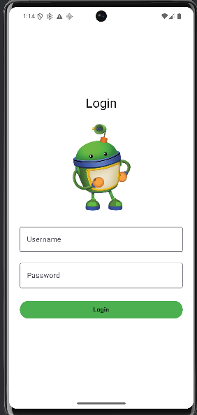
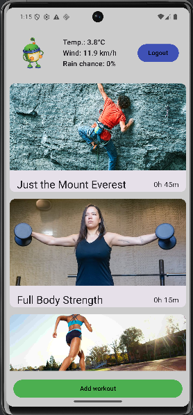
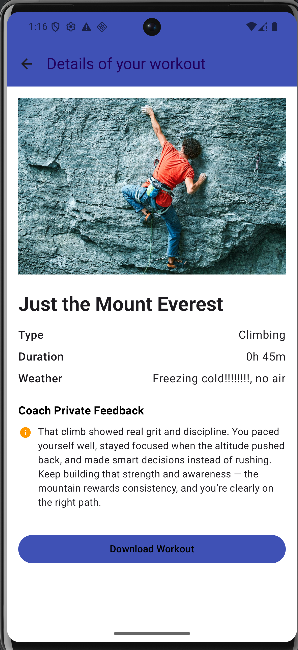
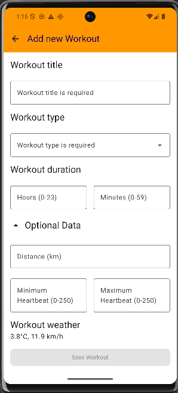
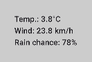
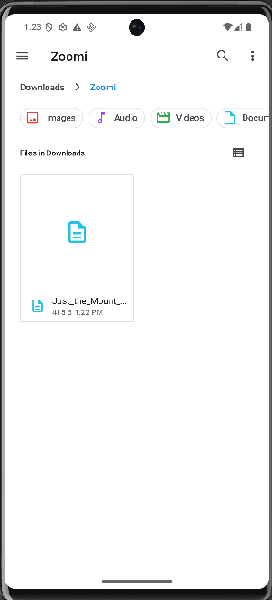

# Mobile Security project -  documentation

## Groupmember
1. Giel Van Poppel
2. René Ruts
3. Gerbe Arys
4. Dylan Van Goethem

## Project summary
We have made a workout tracker application. In the app you can add workouts, review them later on, and so on

## Requirements
### ℹ️ Legend
- :heavy_check_mark: = Implemented
- :x: = Not implemented
- :hourglass: = Work in progress

 
| Status             |Description| Details                                                                                                                                                                                                                             |
|--------------------|---|-------------------------------------------------------------------------------------------------------------------------------------------------------------------------------------------------------------------------------------|
| :hourglass:        | **Application** |                                                                                                                                                                                                                                     | 
| :heavy_check_mark: | 2 UI screens | dylan, gerbe                                                                                                                                                                                                                        |
| :heavy_check_mark: | Secure API request | We are calling the open-meteo.com api to fetch the temperature and the windspeed to display it on the workout overview screen.                                                                                                      |
| :heavy_check_mark: | API request with IDOR | We are calling an own api to fetch a coach's feedback for a workout, this request can be modified and if the user then downloads the workout with that changed feedback the feedback is also changed inside of the downloaded file. |
| :heavy_check_mark: | Connection to room database | the workouts are added in our ZoomiDatabase, every time you create a new workout using the "Add workout" button it gets the current weather of that time.                                                                           |
| :heavy_check_mark: | Secure storage | Giel                                                                                                                                                                                                                                |
|                    |  |                                                                                                                                                                                                                                     | 
|                    | **Security** |                                                                                                                                                                                                                                     | 
| :heavy_check_mark: | Unsafe storage | gerbe                                                                                                                                                                                                                               |
| :x:                | Malware | dylan                                                                                                                                                                                                                               |
| :heavy_check_mark: | Frida functionality | gerbe                                                                                                                                                                                                                               |
| :heavy_check_mark: | Detect root and block functionality | giel                                                                                                                                                                                                                                |


## Overview app
Describe the implementation of the following topics.

###  Screenshots
#### The login screen:


#### The workout overview screen:


#### The workout detail screen:


#### The add workout screen:



###  Secure API request
We are sending a request to the open-meteo.com api to fetch the temperature, the windspeed and the chance of rain for the current location to display it on the overviewscreen.

We get the json in this format:
```json
{
  "latitude": 51.178,
  "longitude": 4.205,
  "generationtime_ms": 0.126838684082031,
  "utc_offset_seconds": 3600,
  "timezone": "Europe/Brussels",
  "timezone_abbreviation": "GMT+1",
  "elevation": 14,
  "current_weather_units": {
    "time": "iso8601",
    "interval": "seconds",
    "temperature": "°C",
    "windspeed": "km/h",
    "winddirection": "°",
    "is_day": "",
    "weathercode": "wmo code"
  },
  "current_weather": {
    "time": "2026-01-02T13:15",
    "interval": 900,
    "temperature": 3.8,
    "windspeed": 23.8,
    "winddirection": 277,
    "is_day": 1,
    "weathercode": 3
  },
  "daily_units": {
    "time": "iso8601",
    "precipitation_probability_max": "%"
  },
  "daily": {
    "time": [
      "2026-01-02",
      "2026-01-03",
      "2026-01-04",
      "2026-01-05",
      "2026-01-06",
      "2026-01-07",
      "2026-01-08"
    ],
    "precipitation_probability_max": [78, 69, 72, 22, 22, 22, 37]
  }
}
```
And we display it on the screen like this:



###  API request with IDOR
We are calling our [own api](https://supabase.co) to fetch a coach's feedback for a workout, this request can be modified and if the user then downloads the workout with that changed feedback the feedback is also changed inside of the downloaded file.

We get the json in this format
```json
[
    {
        "id": 3,
        "body": "That climb showed real grit and discipline. You paced yourself well, stayed focused when the altitude pushed back, and made smart decisions instead of rushing. Keep building that strength and awareness — the mountain rewards consistency, and you’re clearly on the right path."
    }
]
```
###  Room database
We are storing workouts in a room database.
this is the layout of the types:
```kotlin
@Entity(tableName = "workouts")
data class Workout(
    @PrimaryKey(autoGenerate = true)
    val workoutId: Int = 0,
    val type: String,
    val title: String,
    val durationHours: Int,
    val durationMinutes: Int,
    val weatherInfo: String,
    val minHeartbeat: Int?,
    val maxHeartbeat: Int?,
    val distance: Double?
)
```

###  Secure storage
You can download a workout from the detailsscreen of a workout. This gets stored into files on the device.
```kotlin
fun saveWorkoutDetails(context: Context, workout: Workout) {
        val formattedWorkout = formatWorkoutDetails(workout)
        val filename = "${workout.title.replace(" ", "_")}.txt"

        val contentValues = ContentValues().apply {
            put(MediaStore.MediaColumns.DISPLAY_NAME, filename)
            put(MediaStore.MediaColumns.MIME_TYPE, "text/plain")
            if (Build.VERSION.SDK_INT >= Build.VERSION_CODES.Q) {
                put(MediaStore.MediaColumns.RELATIVE_PATH, "Download/Zoomi")
            }
        }

        val resolver = context.contentResolver
        val uri = resolver.insert(MediaStore.Downloads.EXTERNAL_CONTENT_URI, contentValues)

        if (uri != null) {
            try {
                resolver.openOutputStream(uri)?.use { outputStream ->
                    outputStream.write(formattedWorkout.toByteArray())
                    Toast.makeText(context, context.getString(R.string.workout_saved_successfully), Toast.LENGTH_SHORT).show()
                }
            } catch (e: Exception) {
                e.printStackTrace()
                Toast.makeText(context, context.getString(R.string.error_saving_file), Toast.LENGTH_SHORT).show()
            }
        } else {
            Toast.makeText(context, context.getString(R.string.error_creating_file), Toast.LENGTH_SHORT).show()
        }
    }
```


###  Unsecure storage
We have a hardcoded user in our app, the credentials are saved unsecure like this:
```kotlin
private fun validateCredentials(userInput: String, passwdInput: String) : Boolean{
    val passwd = "1234" // password: 1234
    val username = "user" // username: user

    return passwd == passwdInput && username == userInput
}
```

###  Malware
Implementation of malware.

###  Frida
We're going to bypass the isRoot() function to bypass the Root detection

**1. Beforehand**

a. We have to have a rooted device.
  > Root the created AVD and check with the app `rootchecker` (apk available on Leho) if root was successful.
  > 
  > - `git clone https://gitlab.com/newbit/rootAVD`
  > - `cd rootAVD`
  > - `rootAVD.bat ListAllAVDs`
  > - run the one which ends with `ramdisk.img`
  >   - `rootAVD.bat system-images\android-36\google_apis\x86_64\ramdisk.img`
  > - reopen emulator, run rootcheck, select "Forever", it's done.
  > 
  > - `adb install <path_to_app_apk>` => to install apps 

b. We have to install frida server on both the emulator & our host.
  > Download frida-server from this site:
  > 
  > https://github.com/frida/frida/releases
  > 
  > For this case install version `17.5.1` zip file
  >
  > Push the unzipped file to /sdcard/frida and rename it to frida-server
  >
  > then copy it to /data/local/tmp
  > 
  > from the host run `adb shell '/data/local/tmp/frida-server &'`
  > 
  >  to run it on te background on the device.

c. We now have to install frida to our host.
  > In your cmd create a venv environment to install the right python modules

  > then activate the venv environment and run the folowing commands: `pip3 install frida-tools`
  
  > when that is installed you can test if it works with the command: `frida-ps -U` 
  if this gives output frida is installed on your host and you can move on to the next step

  **2. We have to look for interesting functions on the apk.**

  > I've done this for you and I found the isRoot() function inside of the loginScreen.kt file.
  > 
  > Let's first watch what the function does using the following command
  >
  > run `frida-trace -U -j '*!isRoot' -N com.group1.zoomi` from your host
  >
  > It should show the line 'Started tracing x functions.'
  > 
  > When trying to log in it shows that the isRoot function returns 'true' which causes us to not being able to login.

**3. We have to write a script that bypasses the isRoot() function.**
  > I've done this for you:
```javascript
Java.perform(function () {
  var LoginScreenKt = Java.use("com.group1.zoomi.ui.login.LoginScreenKt");

  LoginScreenKt.isRoot.implementation = function (context) {
    console.log("[*] isRoot() got called!");
    return false;
  };
});
```
  > Save this code to a file called `isRoot.js`

**4. Let's bypass the root detection of our app.**
  > run `frida -U -f com.group1.zoomi -l <path_to_isRoot.js_file>`
  >
  > try to login using the credentials and you'll notice the root check is bypassed using frida.

Small demo video:
[Click here to view](ReadmeImages/root-check-bypass-demo.mp4)

###  Root
Implementation of the detecting root and block functionality.

** 1. First we have to import the dependency Rootbeer.**
  > This dependency is added via this import: `import com.scottyab.rootbeer.RootBeer`
  > This dependency does a lot of checks to see if the device is rooted or not, like:
  - Checks if there are apps present that manage root
  - Checks for apps that could hide root
  - Checks for dangerous properties(ro.debuggable and ro.secure) that indicate if it is a genuine android device or not.
  - ...

** 2. Then we create a function that checks if root is present and returns true or false depending on the outcome.**
  > Function:
  ```kotlin
  private fun isRoot(context: Context): Boolean {
    val rootBeer = RootBeer(context)
    return rootBeer.isRooted
}
  ```

** 3. Then add it so the function executes if the login button is clicked.**
  > When root is detected it displays the error "cant't use rooted device" and it does not let you log in.
  > When there is no root detected it checks if the credentials that are entered are correct or not.
  > When both are correct it let's you log in.
  > Code:
  ```kotlin
  Button(
            onClick = {
                if (isRoot(context)) {
                    errorMessage = "Can't use rooted device!"
                } else {
                    if (validateCredentials(username, password)) {
                        onLoginSuccess()
                    } else {
                        errorMessage = "Invalid credentials"
                    }
                }
            }
  ```

## Link to Panopto video
https://

## Repositories
- Code
  - https://gitlab.ti.howest.be/ti/2025-2026/s3/mobilesecurity/students/group-01/zoomi/
- APK
  - [Link to repository]